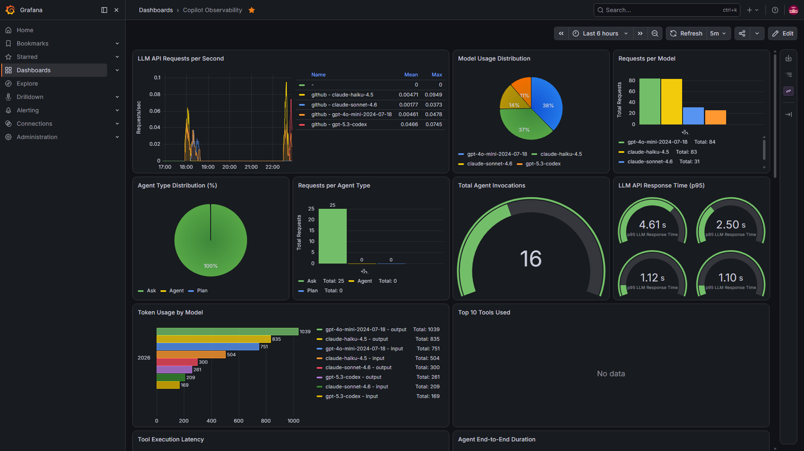
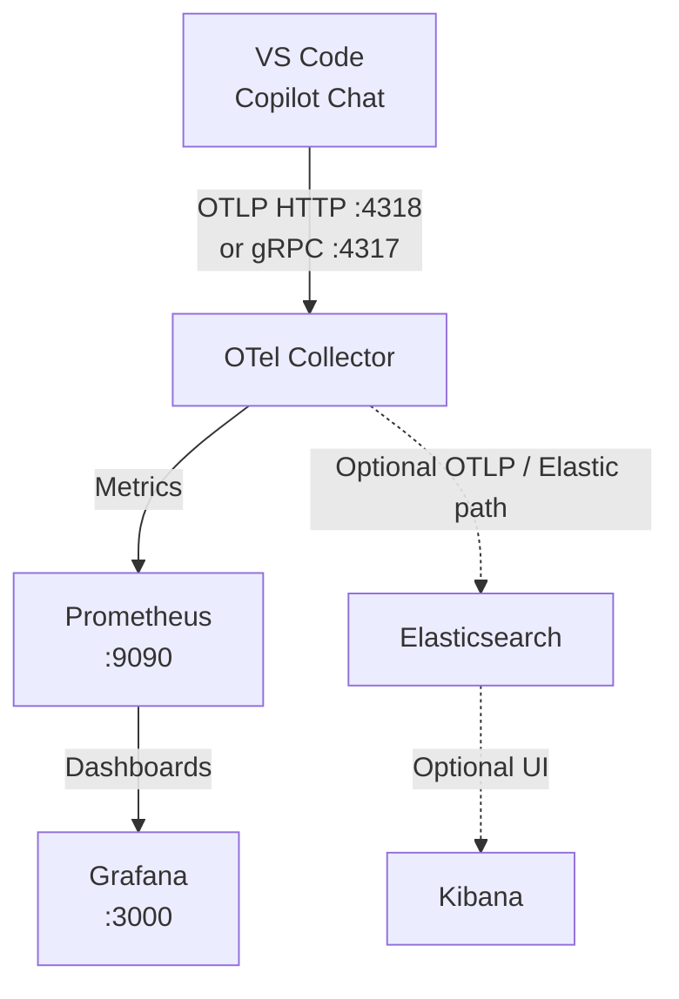

# VS Code Copilot Open Telemetry

A local observability sandbox for capturing and visualizing telemetry from GitHub Copilot Chat. It collects traces emitted by VS Code via OTLP, routes them through an OpenTelemetry Collector, and makes them available in Grafana (dashboards).



## Architecture



**Services**

| Service | Port | Purpose |
|---|---|---|
| OTel Collector | 4317, 4318 | Receives OTLP traces from VS Code |
| Prometheus | 9090 | Metrics storage (scrapes OTel Collector) |
| Grafana | 3000 | Dashboards (queries Prometheus) |

## Sandbox Launch

### Prerequisites

- [Docker](https://docs.docker.com/get-docker/) with Compose

### Run
Start all services:

```sh
docker-compose up -d
```

Check the OTel Collector logs:

```sh
docker-compose logs otel-collector -f
```

Stop all services:

```sh
docker-compose down
```

## VS Code Setup

> [!NOTE]
> Full VS Code reference: [Monitoring agents](https://code.visualstudio.com/docs/agents/guides/monitoring-agents)

**1. Configure VS Code settings**

Open `Preferences: Open User Settings (JSON)` (`Ctrl + Shift + P`) and add:

```json
{
  "github.copilot.chat.otel.enabled": true,
  "github.copilot.chat.otel.exporterType": "otlp-grpc",
  "github.copilot.chat.otel.otlpEndpoint": "http://localhost:4317",
  "github.copilot.chat.otel.captureContent": true,
  "github.copilot.chat.otel.maxAttributeSizeChars": 0
}
```
_You can choose between `otlp-http` and `otlp-grpc`._

**2. Set environment variables (PowerShell, run as Administrator)**

```powershell
# Enable OTel export
[Environment]::SetEnvironmentVariable("COPILOT_OTEL_ENABLED", "true", "Machine")
# Transport protocol: http or grpc
[Environment]::SetEnvironmentVariable("COPILOT_OTEL_PROTOCOL", "grpc", "Machine")
[Environment]::SetEnvironmentVariable("COPILOT_OTEL_EXPORTER_TYPE", "otlp-grpc", "Machine")
[Environment]::SetEnvironmentVariable("COPILOT_OTEL_HTTP_INSTRUMENTATION", "true", "Machine")
# Collector endpoint
[Environment]::SetEnvironmentVariable("OTEL_EXPORTER_OTLP_ENDPOINT", "http://localhost:4317", "Machine")
# Capture full prompt and response content
[Environment]::SetEnvironmentVariable("COPILOT_OTEL_CAPTURE_CONTENT", "true", "Machine")
# Log level: trace, debug, info, warn, error
[Environment]::SetEnvironmentVariable("COPILOT_OTEL_LOG_LEVEL", "debug", "Machine")
```

Restart VS Code after setting environment variables.

## Viewing Data

- **Dashboards:** Open [Grafana](http://localhost:3000) — credentials: `admin` / `not4long`.
- **Optional Kibana path:** Not included in this repo today, but the diagram shows where an Elasticsearch/Kibana branch could sit if you want to test an Elastic-based OTEL pipeline later.
